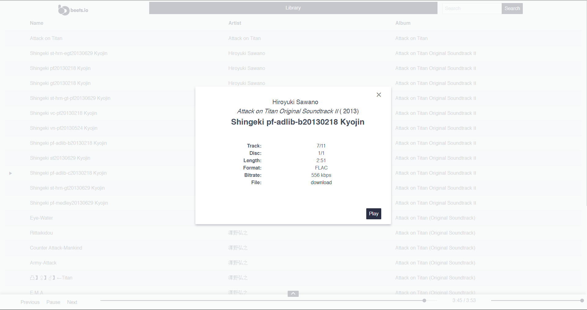

# Credit

Much of the credit goes to the [Adrian Sampson](https://github.com/sampsyo), creator of [beets](https://github.com/beetbox/beets); the group, [beetbox](https://github.com/beetbox); along with all of the  the contributors to the original repository.

The images [Khairul Syuhada](https://github.com/k-syusteem).

# Beets Web Vue

Just a simple front-end for beets using the Spectre CSS framework. I've migrated the original code from Backbone to Vue just for the fun of it, to relearn the framework, though a lot of it for time's sake was simple Copy+Paste.

 It's by no means great, responsive or very professional nor did it require a lot of effort. But I mainly intend to use it for personal use to listen to my library anyway.

# Install

    $ git clone https://github.com/LiamMcLeod/beets-web-alternative.git

    $ pip install -e git+https://github.com/beetbox/beets.git#egg=beets

# Or

    $ git clone https://github.com/beetbox/beets.git
    $ cd beets
    $ pip install -e .

# Then

    Copy the contents my repo into the existing /beetsplug/web directory

# Running

Check out the [Getting Started]( http://beets.readthedocs.org/page/guides/main.html) guide from the creator of beets, be sure to see if there's anything you can do to help and contribute. It's an awesome application.

Ready to go? Use the command:

    $ beet web

# Not happy?

On the Beets repo 

    $ git reset --h
    $ git pull 

and that should overwrite my changes

# Images in Action
Nothing too interesting.

# TODOS
    - Something in LibraryView toggles all buttons if the user drags the mouse over the library.
    - Something in the search part of LibraryView doesn't select or deselect items and the buttons correctly.
    - The bloody slider still doesn't allow seeking/scrubbing through the song